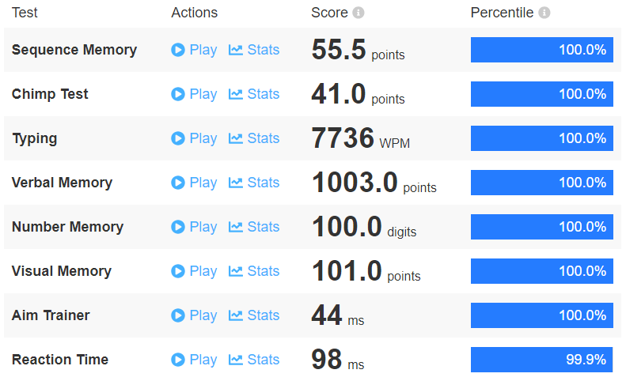

# HumanBenchmark

Simple programs designed to beat (100th percentile) the games on [Human Benchmark](https://humanbenchmark.com/).

## How to use
1. Run `humanBenchmark.py`
2. Insert the number of the test you want to run
3. A browser window will open
4. For some tests it will ask for you preferred score, insert this score
5. It will ask if you are ready to start, if you are: Press enter (For "Reaction Time" you will need to press the window manually the first time)
6. Wait for the test to finish

## Dependencies
- [Selenium](https://pypi.org/project/selenium/)
- [screeninfo](https://pypi.org/project/screeninfo/)